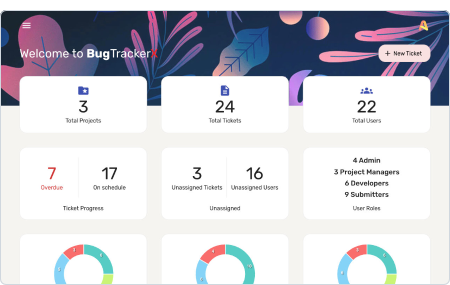
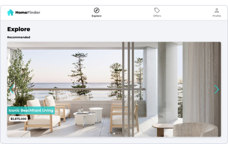
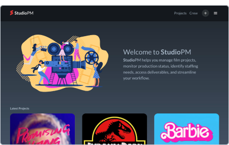
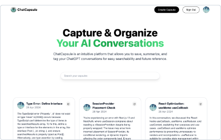

# Hello! 👋

I'm Tristan, a full stack developer with a rich foundation in design, advertising, and screenwriting. This unique blend of experiences has shaped my approach to web development, allowing me to create applications that are not only functional but deeply engaging and intuitive. 

Drawing from my background in visual storytelling and design principles, I specialize in frontend development using React and backend applications with Node.js, MongoDB, and Express. My approach is always user-centric, and I thrive in collaborative environments. 

My diverse career has honed my adaptability and analytical problem-solving skills, making me a distinct asset to any team. [Let's connect and collaborate!](mailto://trisn.work@gmail.com) 

## Projects

### [BugTrackerX](https://github.com/tris-n/bugtrackerx)
A full stack web app for businesses to efficiently track and manage software bugs. 
 
**Frontend:** Javascript React Material-UI Redux Firebase Firestore Framer-Motion ApexCharts Dayjs Toastify 
**Backend:** NodeJS Mongoose Express bcryptjs 
**Database:** MongoDB 
[View Repo](https://github.com/tris-n/bugtrackerx)
[Live Demo](https://www.bugtrackerx.com) 

 

### [HomeFinder](https://github.com/tris-n/homefinder)
A dynamic platform for buying, selling, and renting properties. 
 
**Frontend:** Javascript React Framer-Motion Leaflet Swiper Toastify 
**Backend:** NodeJS Mongoose Express Firebase-Admin bcryptjs 
**Database:** Firebase Firestore 
**APIs:** GoogleMaps API Google OAuth 
[View Repo](https://github.com/tris-n/homefinder)
[Live Demo](https://www.homefinder-app.com) 

 

### [StudioPM](https://github.com/tris-n/studiopm)
A comprehensive film production management tool. 
 
**Frontend:** Javascript React Material-UI Redux Firebase Firestore Framer-Motion Lodash Dayjs Toastify 
**Backend:** NodeJS Mongoose Express bcryptjs 
**Database:** MongoDB 
**APIs:** TheMovieDB 
[View Repo](https://github.com/tris-n/studiopm)
[Live Demo](https://www.mystudiopm.com) 

 

### [ChatCapsule](https://github.com/tris-n/chatcapsule)
A platform for saving ChatGPT conversations for future reference. 
 
**Core Technologies:** TypeScript Next.js Tailwind CSS 
**Database:** MongoDB Mongoose 
**Authentication:** Google Oauth Next-Auth 
[View Repo](https://github.com/tris-n/chatcapsule)
[Live Demo](https://portfolio-chatcapsule-nextjs14.vercel.app/) 